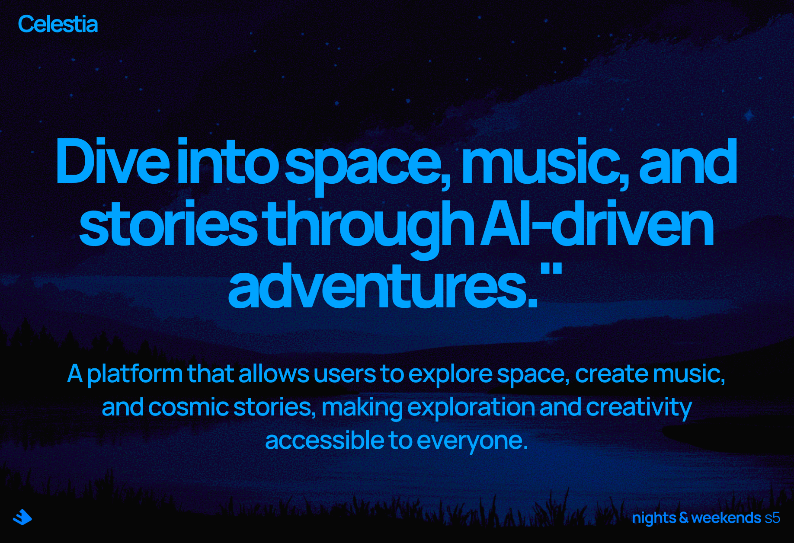

# Celestia



**Dive into space, music, and stories through AI-driven adventures.**

Celestia is an AI-powered platform that allows users to explore space, create music, and craft cosmic stories, making exploration and creativity accessible to everyone.

## Features

1. **Music Generation**: Generate music based on different themes such as space, sci-fi, thriller, and emotional.
2. **Dream/Story Teller**: Generate stories, images, and music from user-provided dreams or prompts, creating immersive narratives.
3. **Explore Space**: Interactively explore celestial objects, learn about space phenomena, and engage in captivating stories about the cosmos.
4. **Space Research and Articles**: Access and study the latest research and articles on space and astronomy.

## Technology Stack

- **Front-end**: React
- **Back-end**: Flask, Python
- **Machine Learning Models**: Pre-trained language models and music generation models

## Getting Started

### Prerequisites

- Node.js and npm installed
- Python and Flask installed

### Installation

1. **Clone the repository:**
   ```bash
   git clone https://github.com/yourusername/celestia.git
   cd celestia
